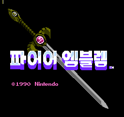
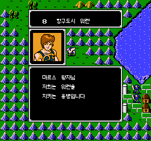
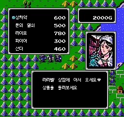

# 파이어 엠블렘 암흑룡과 빛의 검 (패미컴) 한글 패치

## 아카이브 안내

1. 이 저장소는 패미컴판 한글 패치를 계속 유지보수하기보다, 패치를 만들며 진행한 작업과 기록을 공개하는 데 목적이 있습니다. 현재 패치의 유지보수와 후속 업데이트는 더 진행하지 않으므로, 실제 플레이에는 필요에 따라 다른 패치를 사용해도 됩니다.
2. 수정이나 개선이 필요하다면 이 저장소를 포크해 자유롭게 작업할 수 있습니다. 공개된 소스와 문서는 [MIT License](LICENSE) 조건에 따라 수정·빌드·재배포하는 것을 포함해 자유롭게 이용할 수 있습니다. 원작 게임과 제3자 자료의 권리는 각 권리자에게 있습니다.

패미컴용 《파이어 엠블렘 암흑룡과 빛의 검》 일본판에 적용하는 한글 패치입니다. 일본어 대사와 메뉴·전투·시설·엔딩 문구를 한국어로 바꾸며, 원작에 있던 영어·숫자·로마자 표기는 유지합니다.

현재 배포 버전은 `0.1.0`입니다.

## 적용 방법

1. 원본 ROM의 CRC32를 확인합니다.
2. CRC32가 `97CAD370`인 No-Intro 무헤더 ROM에는 [기본 BPS](<./Fire Emblem - Ankoku Ryuu to Hikari no Tsurugi (FC) KR v0.1.0.bps>)를 사용합니다.
3. CRC32가 `3452E97C`인 iNES 헤더 포함 ROM에는 [iNES Header BPS](<./Fire Emblem - Ankoku Ryuu to Hikari no Tsurugi (FC) KR v0.1.0 (iNES Header).bps>)를 사용합니다.
4. [Floating IPS (Flips)](https://github.com/Alcaro/Flips) 같은 BPS 패처에서 BPS 파일과 원본 ROM을 차례로 선택해 적용합니다.
5. 적용 후 ROM의 SHA-1이 `3305b28aca947c4f337ba271d6b10f7943011c5c`인지 확인합니다.

두 BPS는 입력 형식만 다르며 같은 한글판 ROM을 만듭니다. 다른 판본에는 적용할 수 없습니다.

## 화면

| 타이틀 | 장 도입부 | 도구점 |
| --- | --- | --- |
|  |  |  |

## 체크섬

### 지원 원본 ROM — No-Intro 무헤더

`Fire Emblem - Ankoku Ryuu to Hikari no Tsurugi (Japan).nes`

| 알고리즘 | 해시 |
| --- | --- |
| CRC32 | `97CAD370` |
| MD5 | `31b08c81f13e76247f052e80669e8c41` |
| SHA-1 | `dd1d51ff6d57e83f2be0517f1de821c85abe86ae` |
| SHA-256 | `60db7fd78cc849658a42ca648f0d294ebf21e477ddf0753f0e6bbffaad6192ab` |
| 크기 | 393,216바이트 |

### 지원 원본 ROM — iNES 헤더 포함

`Fire Emblem - Ankoku Ryuu to Hikari no Tsurugi (Japan).nes`

| 알고리즘 | 해시 |
| --- | --- |
| CRC32 | `3452E97C` |
| MD5 | `095b2041905318f9026d9a5811e52292` |
| SHA-1 | `0179c550d424e0397496078789e7b116601d120c` |
| SHA-256 | `718770a459c4c1140efcddaa78c2d44eefc32de373692d9fdfcc3a032e1f1731` |
| 크기 | 393,232바이트 |

### 한글 패치 파일 — No-Intro 무헤더용

`Fire Emblem - Ankoku Ryuu to Hikari no Tsurugi (FC) KR v0.1.0.bps`

| 알고리즘 | 해시 |
| --- | --- |
| CRC32 | `2144DF1C` |
| MD5 | `d24b20e68d84c3b15273c5b2224fa6d9` |
| SHA-1 | `f4fcd66983c947e5dde9e6b25836f30d13940bde` |
| SHA-256 | `118e770e3df1d9acf16bdc38c9b933af3668dc533558f9f62603337ffae10de3` |
| 크기 | 116,906바이트 |

### 한글 패치 파일 — iNES 헤더 포함용

`Fire Emblem - Ankoku Ryuu to Hikari no Tsurugi (FC) KR v0.1.0 (iNES Header).bps`

| 알고리즘 | 해시 |
| --- | --- |
| CRC32 | `2144DF1C` |
| MD5 | `b9aca38bf43842b69425a98be308e68a` |
| SHA-1 | `afed1011ef84d1462b6de3bed3e9b2ea0562df20` |
| SHA-256 | `757e20b34e254c656f4809bd662241101ecdf75e906734229d58d94349b5979a` |
| 크기 | 116,239바이트 |

### 패치 적용 후 ROM

| 알고리즘 | 해시 |
| --- | --- |
| CRC32 | `7AABBB0C` |
| MD5 | `6a81034c1803beaebd1673eb7072d822` |
| SHA-1 | `3305b28aca947c4f337ba271d6b10f7943011c5c` |
| SHA-256 | `129aa1d3c0046334991890209c6814484d9d789eac885df515643cfbb4f606e4` |
| 크기 | 786,448바이트 |

## 문제 제보

글자가 깨지거나 게임 진행이 멈추는 문제를 발견하면 [GitHub Issues](https://github.com/mcpads/fc-fire-emblem-shadow-dragon/issues)에 다음 정보를 함께 남겨 주세요.

- 문제가 발생한 장과 화면
- 문제 직전에 선택한 명령
- 사용한 에뮬레이터와 버전
- 가능하면 스크린샷과 배터리 저장 파일

## 패치 정보

- 버전: `0.1.0`
- 한글 글꼴: [Dalmoori](https://github.com/RanolP/dalmoori-font), Apache-2.0
- 패치 제작: mcpads
- 개발 보조: Codex

## 라이선스

- 이 저장소의 소스 코드는 [MIT License](LICENSE)로 제공합니다.
- Dalmoori 글꼴의 고지는 [별도 라이선스](assets/fonts/LICENSE.dalmoori)를 따릅니다.
- BPS 패치는 개인적·비상업적 용도로 제공합니다. 패치가 적용된 ROM이나 원본 ROM은 배포하지 않습니다.
- 원작 게임의 저작권은 해당 권리자에게 있습니다.
